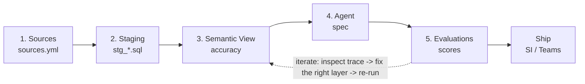
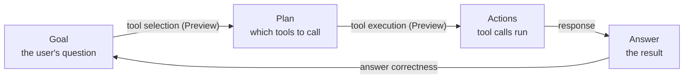

# Cortex Agents + dbt Template

Trustworthy pipelines for AI agents. How to manage the full Cortex Agent lifecycle (semantic views, agent specs, evaluations, and scheduling) as version-controlled, tested, reproducible code with dbt Projects on Snowflake.

Built from the `cortex-agents-dbt-project-template` (see [dbt Projects on Snowflake](https://docs.snowflake.com/en/user-guide/data-engineering/dbt-projects-on-snowflake)). The walkthrough mirrors the project's `WORKING-SESSION.md` runbook; the reference pages draw on its `README.md` best practices.

---

## Table of contents

1. [Why agents-as-code](#why-agents-as-code)
2. [Build Runbook (5 phases)](#build-runbook)
3. [Semantic Views](#semantic-views)
4. [Agent Spec](#agent-spec)
5. [Cortex Agent Evaluations](#cortex-agent-evaluations)

---

## Why agents-as-code

An AI agent is only as trustworthy as the data and the process behind it. Yet most agents are assembled by **click-ops** in a UI: no version history, no peer review, no tests, and no reliable way to promote the same thing from dev to prod. When the agent gives a wrong answer, there is nothing to diff and nothing to roll back.

### The problem: click-ops agents

- **No version control**: changes live only in the UI
- **No peer review**: nobody signs off before prod
- **No tests**: accuracy is a vibe, not a metric
- **No reproducibility**: dev and prod drift apart
- **No promotion path**: rebuilding by hand per environment

### The fix: agents as code

- **Git-backed**: every change diffed and reviewable
- **PR review + CI**: builds on dev before merge
- **Measured**: evaluations gate on >=95% correctness
- **One codebase**: `env.yml` targets dev / staging / prod
- **One command**: `EXECUTE DBT PROJECT` rebuilds it all

### What the template delivers

| Metric | Value |
|:--|:--|
| Phases from questions to production | 5 |
| Environments, one codebase | 3 |
| Answer-correctness bar to ship | >=95% |
| Click-ops steps | 0 |
| `EXECUTE DBT PROJECT` to rebuild | 1 |

### The lifecycle, at a glance



One dbt project builds every box. The feedback loop is where evaluation scores drive the next improvement cycle.

---

## Build Runbook

Five phases take you from a list of business questions to a shipped, evaluated agent. Every object is built by the same dbt project. Each phase states what you decide, which files change, and the exact command to run live.

```
1 · Setup -> 2 · Semantic View -> 3 · The Agent -> 4 · Evaluation -> 5 · Ship
```

**The contract:** before each phase, decide whether to *infer* values from your data or *specify* them. At the end of each build phase, run the materialize command and confirm success. Never advance past a failing gate.

### Prerequisites

Confirm the ground rules before Phase 0. If anything is missing, resolve it first.

| Requirement | Check |
|:--|:--|
| Dependencies installed | `dbt deps` has run (the `dbt_semantic_view` package is present) |
| `env.yml` configured | Real `DBT_DATABASE` / `DBT_WAREHOUSE` per environment; `profiles.yml` reads them via `env_var()` |
| Source data exists | The tables you'll model are queryable by your role |
| Cortex Agents enabled | Account has Cortex Agents + `CREATE SEMANTIC VIEW` / `CREATE AGENT` privileges |
| External Access Integration | Exists for `dbt deps` package downloads |
| Snowflake CLI >= 3.21 | Only for the CLI path; `env.yml` flags need 3.21+ (`snow --version`) |

### One codebase, three environments

The template is environment-driven. `env.yml` defines `dev`, `staging`, and `prod`; Snowflake resolves it at run time and injects values that `profiles.yml` reads with `env_var()`. You never hardcode a target; you pick an environment and the same code runs against it.

| Environment | Database | Schema | Role |
|:--|:--|:--|:--|
| `dev` (default) | `DEV_DB` | `CURRENT_USER()` (per-developer) | `CURRENT_ROLE()` |
| `staging` | `STAGING_DB` | `CORTEX_AGENTS` | `SYSADMIN` |
| `prod` | `PROD_DB` | `CORTEX_AGENTS` | `SYSADMIN` |

Per-developer schemas in `dev` mean each engineer's agents, semantic views, and evaluations are isolated, so nobody overwrites anyone else while iterating.

```
# How the target resolves at run time
EXECUTE DBT PROJECT ... ENVIRONMENT = 'dev'
   -> env.yml picks 'dev', evaluates {{ select CURRENT_USER() }}
   -> injects DBT_DATABASE / DBT_SCHEMA / DBT_WAREHOUSE / DBT_ROLE
   -> profiles.yml reads env_var() -> target.database / schema / ...
   -> everything dbt builds lands in that target; the agent macro
     substitutes the same values into the agent spec
```

### Phase 0 — Orientation

**Goal:** Lock in the environment, the target, and the object names everything else references.

Confirm the environment (default `dev`), the resolved `<db>.<schema>`, and pick names for the semantic view, the agent, and the evaluation run.

**Gate:** Infer these from your environment/conventions, or specify them explicitly?

**Done when:** environment, target, and names are confirmed and written down for reuse in every later phase.

### Phase 1 — Business Questions -> Semantic View

**Goal:** Capture the ~10 questions the agent must answer, then model the data to support them.

Edit `models/sources.yml`, optional `models/staging/stg_*.sql`, and the semantic view `models/semantic_views/sv_<name>.sql`. Author the clauses in this **enforced order**:

```
TABLES -> RELATIONSHIPS -> FACTS -> DIMENSIONS -> METRICS -> COMMENT
      -> AI_SQL_GENERATION -> AI_QUESTION_CATEGORIZATION -> AI_VERIFIED_QUERIES
```

The two `AI_*` clauses are optional and additive: how the agent writes SQL, and what to do with a question before SQL is attempted. See [Semantic Views](#semantic-views) for the deep dive.

**Gate:** Infer dimensions/metrics and the AI_* rules from your sources, or specify them?

**Demo — materialize:**

```bash
dbt build --select sv_<name>
```

Build the semantic view and confirm a sample `SELECT ... FROM SEMANTIC_VIEW(...)` returns rows.

**Why this matters:** the semantic view is where Cortex Analyst gets its accuracy. Business names, curated synonyms, verified queries, and the two `AI_*` clauses all live here.

### Phase 2 — Agent Reasoning -> Orchestration

**Goal:** Define how the agent plans and routes between tools, the highest-impact accuracy lever after tool descriptions.

Phases 2–4 all author into the **same place**: the inline `spec` inside the `deploy_<agent>` macro in `agents/<agent>.sql`. The agent object is created once, at the end of Phase 4.

Put tool routing, default time windows, multi-step sequencing, conditional logic, and error/empty-result handling in `instructions.orchestration`. Keep tone and formatting *out* (that's Phase 3).

**Gate:** Infer orchestration logic from your questions and tools, or specify it?

**Materialize:** none yet; continue to Phase 3.

### Phase 3 — Agent Response -> Response Instructions

**Goal:** Define how the agent formats and communicates answers, separate from tool routing.

Put tone, data presentation (tables vs. charts, units), response structure by question type, disclaimers, and error-message style in `instructions.response`. Add 3+ representative `instructions.sample_questions`.

**Rule of thumb:** if the instruction affects *what* the agent does or *which* tool it picks, it's orchestration. If it affects *how* the output looks, it's response.

**Gate:** Infer response style from the use case and audience, or specify it?

**Materialize:** none yet; continue to Phase 4.

### Phase 4 — Agent Tools -> Tool Descriptions (create the agent)

**Goal:** Wire up tools and their resources, then create the agent. Tool descriptions are the single most critical factor for accuracy.

For each tool write the 4-part description: what data it accesses, when to use it, **when NOT to use it**, and input/format guidance. Point the Analyst tool at `<<DATABASE>>.<<SCHEMA>>.SV_<NAME>` and set `execution_environment.warehouse` to `<<WAREHOUSE>>`. See [Agent Spec](#agent-spec) for the deep dive.

**Gate:** Infer tool descriptions from the semantic view and use case, or specify them?

**Demo — create the agent:**

```bash
dbt run-operation deploy_<agent>

# Zero-downtime edit to a live agent later:
dbt run-operation deploy_<agent> --args '{alter: true}'
```

The wrapper defines the spec inline and calls `create_agent` (CREATE OR REPLACE). No `--args` needed.

**Done when:** `<db>.<schema>.<AGENT>` exists and answers a sample question.

### Phase 5 — Evaluation

**Goal:** Turn the confirmed questions and answers into a measurable evaluation run: scores you can track, compare, and improve against.

| Metric | Ground truth? | What it measures |
|:--|:--|:--|
| `answer_correctness` | Yes | How closely the reply matches the expected answer |
| `logical_consistency` | No | Whether the reasoning chain is coherent and contradiction-free |
| `tool_selection_accuracy` | Yes | Whether the agent called the expected tools |
| `tool_execution_accuracy` | Yes | Whether tool calls had the right inputs/outputs |

Start with **AC-track** rows (`answer_correctness` + `logical_consistency`); add **TEA-track** rows for tool metrics once the agent is stable. Aim for 15–20 questions across easy/medium/hard.

**Gate:** Infer ground-truth answers from your data, or specify them?

**Demo — run the evaluation:**

```bash
dbt seed
dbt run --select eval_dataset
dbt run-operation run_evaluation --args '{agent_name: <agent>, run_name: <run>, config_file: <config>.yml}'
```

**Demo — check status & scores:**

```sql
-- status any time
CALL EXECUTE_AI_EVALUATION('STATUS', {'run_name': '<run>'}, NULL);

-- scores after completion
SELECT * FROM TABLE(SNOWFLAKE.LOCAL.GET_AI_EVALUATION_DATA(
  '<db>', '<schema>', '<AGENT>', 'CORTEX AGENT', '<run>'));
```

**Done when:** scores return and you can identify the lowest-scoring questions to drive the next cycle.

### Ship & automate

With a passing score in hand (target **>=95%** answer correctness), promote, ship, and automate: same code, prod target.

| Move | How |
|:--|:--|
| Iterate live | `dbt run-operation deploy_<agent> --args '{alter: true}'` (zero-downtime) |
| Promote to prod | Re-run Phases 1, 4, 5 with `--env prod` (CLI) or the Workspace environment selector |
| Ship to users | Snowflake Intelligence, Microsoft Teams, the Cortex Agent REST API, or MCP |
| Automate (CI/CD) | GitHub Actions: PR builds on dev, merge deploys to prod (the `.github/workflows/*.example` files) |
| Schedule | Snowflake Tasks running `EXECUTE DBT PROJECT ... ARGS='build --target prod'` |

```sql
-- schedule daily builds + evaluation as Snowflake Tasks
CREATE OR REPLACE TASK daily_cortex_build
  WAREHOUSE = ANALYTICS_WH
  SCHEDULE = 'USING CRON 0 6 * * * America/Denver'
AS EXECUTE DBT PROJECT DEV_DB.CORTEX_AGENTS.CORTEX_LIFECYCLE ARGS='build --target prod';
ALTER TASK daily_cortex_build RESUME;
```

### The CLI path (snow >= 3.21)

Inside a Snowsight Workspace you run dbt directly and pick the environment in the run panel. On the CLI, deploy once then execute, with two rules learned the hard way:

```bash
# deploy the project object (--default-env sets the compile/run env)
snow dbt deploy cortex_lifecycle --source . \
  --default-env dev --external-access-integration dbt_ext_access --force

# build with an environment. --env MUST come BEFORE the project name;
# use the fully-qualified name so EXECUTE DBT has a database context.
snow dbt execute --env dev DB.SCHEMA.cortex_lifecycle build

# deploy the agent -- the wrapper macro carries the spec, no --args
snow dbt execute --env prod DB.SCHEMA.cortex_lifecycle run-operation deploy_<agent>
```

### Troubleshooting

| Symptom | Fix |
|:--|:--|
| Eval errors: *"dataset already exists"* | Remove the `dataset:` block from the config after the first successful run |
| `ground_truth` rejected / wrong type | Must be VARIANT: keep `PARSE_JSON(...)` in `eval_dataset.sql`; do not switch to `OBJECT_CONSTRUCT` |
| Agent can't find the semantic view | Spec must reference `<<DATABASE>>.<<SCHEMA>>.SV_<NAME>` (tokens substituted at deploy) |
| Poor tool routing | Tighten each `tools[].description`: what it's for AND what it's not for |
| `dbt deps` can't reach the hub | Provide the External Access Integration name |
| `snow dbt` rejects `--env` or mangles `--args` | CLI older than 3.21; upgrade, or run from a Snowsight Workspace |
| *"No such option '--env'"* | `--env` was placed after the project name; it must come before |
| *"session does not have a current database"* | Use the fully-qualified project name `<db>.<schema>.<project>` |
| Macro fails on `load_file_contents` / `` | No runtime file read; specs live in the `deploy_<agent>` wrapper macro, not a raw `.yml` |

---

## Semantic Views

The semantic view is what makes Cortex Analyst accurate. It is the context the agent reasons over. Get it right and answers stay correct under scrutiny. Get it wrong and no amount of agent tuning compensates.

**Why this comes first:** most agent accuracy is won or lost here, before the agent spec is ever written.

### High-leverage practices

- **Business names + curated synonyms.** Name objects the way users speak ("Revenue", not `AMT_TOT`). Add a few real alternate phrasings, but avoid auto-generated synonym spam.
- **Comments that teach.** At view, table, and column level, state business meaning, **grain**, and any exclusions or caveats.
- **Model KPIs as metrics.** Put canonical calculations in `METRICS` (`net_sales`, `avg_order_value`). Use `FACTS` for reusable row-level expressions, `DIMENSIONS` for grouping/filtering.
- **Sample values + enums.** Add `SAMPLE_VALUES` so the model maps phrasing to real filter values. Add `IS_ENUM` only when the listed values are the complete set (and it must come after `SAMPLE_VALUES`).
- **Verified queries.** `AI_VERIFIED_QUERIES` for common and failure-prone questions, phrased how users actually ask, one of the strongest accuracy levers.
- **Explicit keys & relationships.** Declare `PRIMARY KEY` / `UNIQUE` and named `RELATIONSHIPS`. Prefer a clean star shape; disambiguate multi-path metrics with `USING (relationship_name)`.

**Keep scope tight.** Start with ~3–5 tables and roughly 50–100 columns total. Smaller, focused views outperform "do-it-all" models, because Cortex Analyst has a limited context window. Split by domain when needed.

### The AI_* clauses: additive and independent

Two optional, completely independent modules. Use neither, one, or both. Start with what you know is wrong today; add rules as you find gaps during testing. Over-prompting degrades accuracy and raises token cost.

| Clause | Fires | Good candidates |
|:--|:--|:--|
| `AI_SQL_GENERATION` *(how the agent writes SQL)* | During SQL generation | Default time filters ("no date -> last 30 days"); fiscal calendar offsets; rounding/formatting; domain classification ("stock CRITICAL <10, LOW 10–24, OK 25+"); enum casing quirks |
| `AI_QUESTION_CATEGORIZATION` *(what to do with a question)* | Before SQL is attempted | Reject out-of-scope topics ("employee data -> contact HR"); table routing when unrelated tables share a view; ask for clarification on ambiguous questions; encoding guardrails (doubled single quotes for apostrophes) |

**Keep SQL-generation rules here, not in the agent.** Rounding, metric synonyms ("sales" = `net_sales`), and default filters belong in `AI_SQL_GENERATION`, not in agent instructions. One source of truth.

### Clause order is enforced

Author the DDL in exactly this sequence. `COMMENT` must come **before** the `AI_*` clauses, and `AI_VERIFIED_QUERIES` comes last.

```
TABLES -> RELATIONSHIPS -> FACTS -> DIMENSIONS -> METRICS -> COMMENT
      -> AI_SQL_GENERATION -> AI_QUESTION_CATEGORIZATION -> AI_VERIFIED_QUERIES
```

**Gotcha:** placing `COMMENT` after the `AI_*` clauses raises `unexpected 'COMMENT'`. Order is not a suggestion.

#### Annotated skeleton

```sql
{{ config(materialized='semantic_view') }}

CREATE OR REPLACE SEMANTIC VIEW sv_sales
  TABLES (
    orders PRIMARY KEY (order_id) -- one row per order
  )
  RELATIONSHIPS ( -- FK joins between tables (clean star) )
  FACTS      ( orders.line_total AS quantity * unit_price )
  DIMENSIONS ( orders.region WITH SAMPLE_VALUES ('WEST','EAST') )
  METRICS    ( orders.net_sales AS SUM(line_total) )
  COMMENT = 'Order-grain sales. Excludes cancelled orders.'
  WITH AI_SQL_GENERATION   -- how to write SQL (defaults, rounding)
  WITH AI_QUESTION_CATEGORIZATION -- routing / reject / clarify
  WITH AI_VERIFIED_QUERIES  -- confirmed Q&A pairs (last) ;
```

Materialize it with `dbt build --select sv_<name>`, then confirm a sample `SELECT ... FROM SEMANTIC_VIEW(sv_<name> ...)` returns rows. Built into `{DBT_DATABASE}.{DBT_SCHEMA}` automatically, since it inherits the dbt target.

---

## Agent Spec

Agent quality comes mostly from three things, and mixing them is the most common cause of poor answers. Keep them in separate layers, and let tool descriptions do the heavy lifting on routing.

**Prerequisite:** a strong agent needs a strong semantic view underneath it. If you skipped it, start with [Semantic Views](#semantic-views).

### The three-layer model

| Layer | Field | Put here | Keep out |
|:--|:--|:--|:--|
| Orchestration | `instructions.orchestration` | Tool routing, intent defaults (e.g. default time window), scope limits, multi-step workflows, fallback when a tool errors or returns nothing | Tone, formatting, SQL-generation rules |
| Response | `instructions.response` | Tone, answer-first structure, tables vs. charts, units/currency, data freshness, handling ambiguity or empty results | Tool routing, SQL-generation rules |
| Tool description | `tools[].tool_spec.description` | What the tool does, what data it accesses, when to use it, when NOT to use it, input guidance | — |

**Rule of thumb:** if it affects *what* the agent does or *which* tool it picks -> orchestration. If it affects *how* the output looks -> response. If it describes a tool -> the tool's description.

### Tool descriptions drive routing accuracy

Agents pick tools by name and description alone, not by inspecting your data model. This is the single biggest lever on routing accuracy. Write every description with this formula:

1. **What it does** + what data it accesses (grain, metrics, history, refresh)
2. **When to use** — specific question types, with examples
3. **When NOT to use** — critical: stops overuse for anything remotely related
4. **Input guidance** — units, date formats, key filter values

Give every tool a distinct domain and a non-overlapping "when to use", and always include an explicit "when NOT to use". When you have multiple Analyst tools, the descriptions are what let the agent tell them apart.

**The negative case earns its keep:** without an explicit "when NOT to use", the agent reaches for a tool on anything remotely related. That one line prevents a whole class of wrong-tool answers.

### Failure patterns & fixes

| Symptom | Likely cause | Fix |
|:--|:--|:--|
| Wrong tool selected | Vague "When to use" | Add specific examples + "When NOT to use" |
| Parameter errors | Ambiguous inputs | Add format, examples, constraints |
| Hallucinations | Agent using the wrong tool | Tighten negative routing in the description |

**Consistency matters:** use the same terminology across all instructions and descriptions. If orchestration says "customers" but a tool description says "accounts", the agent will misbehave. Keep the total number of tools to 5–10; smaller, focused agents are faster and more reliable.

Diagnosing routing problems is exactly what evaluations are for. See [Cortex Agent Evaluations](#cortex-agent-evaluations) for measuring tool selection and execution accuracy.

### Where the spec lives (and how it deploys)

dbt Projects on Snowflake has no runtime file read, so each agent's spec lives inline in a `deploy_<agent>` wrapper macro in `agents/<agent>.sql`. The wrapper passes the spec to `create_agent` / `alter_agent`, which substitute the environment tokens with the active target, so the same spec deploys to dev, staging, or prod unchanged.

```sql

  
    models: { orchestration: auto }
    instructions:
      orchestration: "routing + defaults + fallbacks"
      response:      "tone, tables vs charts, units"
      sample_questions: [ ... ]
    tools:
      - tool_spec:
          name: sales_analyst
          description: "what + when + when NOT + inputs"
    tool_resources:
      sales_analyst:
        semantic_view: <<DATABASE>>.<<SCHEMA>>.SV_SALES
        execution_environment: { type: warehouse, warehouse: <<WAREHOUSE>> }
  
  {{ create_agent('example_agent', spec) }}

```

**Required:** every `cortex_analyst_text_to_sql` tool needs an `execution_environment` under `tool_resources` (the warehouse its SQL runs in). Use `execution_environment: { type: warehouse, warehouse: <name> }`, not a top-level `warehouse` key.

Deploy with `dbt run-operation deploy_<agent>` (CREATE OR REPLACE). For zero-downtime edits to a live agent, add `--args '{alter: true}'`.

---

## Cortex Agent Evaluations

This is how agent readiness is measured. Cortex Agent evaluations let you test, baseline, and hill-climb on an agent's behavior so you know when it is ready to roll out, scoring not just the final answer but each step of its reasoning.

**Status:** Cortex Agent evaluations reached **general availability** on 2026-03-13 (answer correctness, logical consistency, custom metrics). The two tool metrics (tool selection and tool execution accuracy) are in **public preview** as of 2026-06-11.

This is the deep dive behind the walkthrough's Phase 5: Evaluation. Where the walkthrough shows the commands to run, this page explains the framework, the metrics, and how to iterate.

Sources: [Cortex Agent evaluations](https://docs.snowflake.com/en/user-guide/snowflake-cortex/cortex-agents-evaluations), [AI Observability in Snowflake Cortex](https://docs.snowflake.com/en/user-guide/snowflake-cortex/ai-observability).

### Why evaluate

Cortex Agent evaluations let you test, baseline, and hill-climb on an agent's behavior and performance, so you know when it is ready to roll out. You evaluate against both ground-truth and reference-free metrics, and the agent's activity is traced and monitored so you can see each step on the way to its answer.

#### The Goal-Plan-Action framework

Instead of judging only the final answer, the metrics follow Snowflake's **Goal-Plan-Action (GPA)** framework: they evaluate the agent at each stage of its reasoning, so you can pinpoint where it went wrong or was inefficient. The four system metrics trace the loop from the user's goal to the agent's answer.



*Logical consistency spans the whole loop, reference-free.*

- **Tool selection accuracy** covers goal to plan: does the orchestration layer invoke the tools you expect for the user's goal?
- **Tool execution accuracy** covers plan to actions: does each tool that runs get appropriate input and return output that meets your requirements?
- **Answer correctness** closes the loop from actions back to goal: how closely does the final response match the expected ground truth?
- **Logical consistency** spans the whole loop: consistency across instructions, planning, and tool calls. It is reference-free, so it needs no ground truth.

#### Access to run an evaluation

Evaluations compute their metrics with the `AI_COMPLETE` function using LLM-as-a-judge, so the role that runs an evaluation needs, among others:

- The `SNOWFLAKE.CORTEX_USER` database role and the `USE AI FUNCTIONS` privilege (to call `AI_COMPLETE`).
- `EXECUTE TASK ON ACCOUNT`, and `USAGE` on the databases and schemas holding the agent and the evaluation data.
- `USAGE` / `OWNERSHIP` and `MONITOR` on the agent, and access to every tool the agent uses.
- In Snowsight, `USAGE` on the warehouse used for the run.

### The metrics

Four system metrics trace the Goal-Plan-Action loop. Three compare against ground truth; logical consistency is reference-free. All are computed by an LLM judge (the `AI_COMPLETE` function).

#### System metrics

| Metric | GPA stage | Ground truth? | What it measures | Status |
|:--|:--|:--|:--|:--|
| `answer_correctness` | actions -> goal | Yes (`ground_truth_output`) | How closely the agent's streamed reply matches the expected answer | GA |
| `logical_consistency` | whole loop | No (reference-free) | Consistency across the agent's instructions, planning, and tool calls | GA |
| `tool_selection_accuracy` | goal -> plan | Yes (`ground_truth_invocations`) | Whether the agent invoked the tools you expected (order-independent) | Preview |
| `tool_execution_accuracy` | plan -> actions | Yes (`ground_truth_invocations`) | Whether each tool call had appropriate input and returned acceptable output | Preview |

**Start reference-free, add tools later.** Begin with `answer_correctness` + `logical_consistency`. Add the tool metrics once the agent is stable and you can describe the tool calls you expect.

#### Custom metrics (LLM-as-a-judge)

Beyond the system metrics, you can define your own. A custom metric supplies a **prompt** and a **scoring range** that are passed to the LLM judge along with the run trace. Custom metrics can be ground-truth-based or reference-free, and their prompts can reference trace data with placeholders like `{{input}}`, `{{output}}`, `{{ground_truth}}`, and `{{tool_info}}`. Use them for domain-specific checks the streamed reply doesn't expose, for example which tables the agent touched.

```yaml
metrics:
  - "answer_correctness"
  - "logical_consistency"
  - name: "relevance"
    score_ranges:
      min_score: [1, 3]      # low
      median_score: [4, 6]   # medium
      max_score: [7, 10]     # high
    prompt: |
      Rate 1-10 how relevant the response is to the user's query.
      Compare {{output}} against {{ground_truth}} ...
```

The judge normalizes each score to the range 0.0 to 1.0. Evaluations currently run the judge on `claude-4-sonnet` using cross-region inference.

### The dataset

An evaluation dataset is a table with two columns: the input query, and a ground-truth VARIANT the judges compare against. What you put in the VARIANT depends on which metrics you enable.

| Column | Type | Holds |
|:--|:--|:--|
| `input_query` | VARCHAR | The user query to evaluate |
| `ground_truth` | VARIANT | A JSON object describing the expected behavior |

#### Two keys, two tracks

- **`ground_truth_output`** feeds `answer_correctness` (the "AC track"). It is compared to everything the user sees in the streamed reply.
- **`ground_truth_invocations`** feeds tool selection and execution accuracy (the "tool track"). It is an array of expected tool calls, each with `tool_name` and optional `tool_input` / `tool_output`.
- **`logical_consistency`** is reference-free and needs no ground truth, so a row can leave the column empty.

One VARIANT can carry keys for several metrics at once, so a single dataset can drive answer correctness, the tool metrics, and custom metrics in the same run. Start with AC-track rows; add tool-track rows once the agent is stable.

**The no-tool guardrail:** set `"ground_truth_invocations": []` (an empty array) to verify the agent correctly abstains from calling any tool on an out-of-scope question.

#### Insert a row with PARSE_JSON

```sql
CREATE OR REPLACE TABLE agent_evaluation_data (
  input_query VARCHAR,
  ground_truth VARIANT
);

INSERT INTO agent_evaluation_data
  SELECT
    'What was Q1 2025 revenue by product category, and what does our return policy say for electronics?',
    PARSE_JSON('
      {
        "ground_truth_output": "Q1 2025 revenue was ~1.2M Services, 1.4M Hardware, 1.1M Subscriptions USD. Electronics: 30-day returns, 1-year warranty.",
        "ground_truth_invocations": [
          { "tool_name": "finance_analyst",
            "tool_input": "Q1 2025 revenue by product category",
            "tool_output": "SQL aggregating revenue by category for Jan-Mar 2025, ~3 rows near 1.2M/1.4M/1.1M." },
          { "tool_name": "product_docs_search",
            "tool_input": "return policy and warranty for electronics",
            "tool_output": "Policy page mentioning 30-day returns and a 1-year warranty." }
        ]
      }
    ');
```

**Use PARSE_JSON, not OBJECT_CONSTRUCT.** `OBJECT_CONSTRUCT` / `ARRAY_CONSTRUCT` return OBJECT and ARRAY, not VARIANT. Wrap the JSON in `PARSE_JSON` (or `TO_VARIANT`) to guarantee the column type. This mirrors the template's rule to keep `PARSE_JSON` in `eval_dataset.sql`.

#### Writing good ground truth

Because `ground_truth_output` is fed to an LLM prompt, treat it as a plain-language **rubric** built from literal, verifiable values:

- **Known, stable answer:** state the value with rounding, tolerance, units, and scope ("within +/-2% of 123.45; exclude test accounts").
- **Live or changing answer:** describe what a correct reply should and should not contain, in enough detail that two readers would agree.
- **Out-of-scope:** state that the agent should refuse and not fabricate.

### Run & inspect

Drive evaluations from SQL, from a YAML config, or from the Snowsight Evaluations tab. Under the hood it is one function to run and a few functions to read results back.

#### Run with EXECUTE_AI_EVALUATION

One function handles the lifecycle via a verb: `'START'`, `'STATUS'`, `'CANCEL'`, or `'DELETE'`. It takes the run name and a stage path to the config YAML.

```sql
-- start a run named run-1 from a config on a stage
CALL EXECUTE_AI_EVALUATION(
  'START',
  OBJECT_CONSTRUCT('run_name', 'run-1'),
  '@eval_db.eval_schema.metrics/agent_evaluation_config.yaml'
);

-- check progress. STATUS / CANCEL / DELETE need the object, and take no stage path.
CALL EXECUTE_AI_EVALUATION('STATUS', OBJECT_CONSTRUCT(
  'run_name',    'run-1',
  'object_name', 'eval_db.eval_schema.evaluated_agent',
  'object_type', 'CORTEX AGENT'));
```

**Schedule it.** Because it is a function call, you can wrap `EXECUTE_AI_EVALUATION` in a Snowflake Task to run or check evaluations on a cadence, exactly as the walkthrough's Ship & Automate step does.

#### The config YAML

The config has three top-level keys: an optional `dataset` (to build a dataset from a table), `evaluation` (which agent + which dataset), and `metrics` (built-in strings plus any custom definitions).

```yaml
evaluation:
  agent_params:
    agent_name: "eval_db.eval_schema.evaluated_agent"
    agent_type: "CORTEX AGENT"
  source_metadata:
    type: "dataset"
    dataset_name: "EVALUATION_INPUT"
metrics:
  - "answer_correctness"
  - "logical_consistency"
```

**Required:** `agent_name` must be fully qualified as `database.schema.object`. A bare name is rejected at start. See [Traps](#traps-that-do-not-error).

**Repeat-run gotcha:** if the YAML keeps a `dataset:` block, Snowflake tries to create the dataset on every run and can fail with "already exists". For repeated runs on the same dataset, remove the `dataset:` block and keep only `evaluation:` + `metrics:`. This is the same fix the template calls out for its eval config.

#### Read results back

| Function (SNOWFLAKE.LOCAL) | Returns |
|:--|:--|
| `GET_AI_EVALUATION_DATA(db, schema, agent, 'CORTEX AGENT', run)` | Full per-record evaluation details and scores for a run |
| `GET_AI_RECORD_TRACE(db, schema, agent, 'CORTEX AGENT', record_id)` | The full trace for a single record, to see where the agent went wrong |
| `GET_AI_OBSERVABILITY_LOGS(db, schema, agent, 'CORTEX AGENT')` | Warnings and errors from a run (filter by severity + run name) |

```sql
SELECT * FROM TABLE(SNOWFLAKE.LOCAL.GET_AI_EVALUATION_DATA(
  'eval_db', 'eval_schema', 'evaluated_agent', 'CORTEX AGENT', 'run-1'));
```

#### Or use the Snowsight Evaluations tab

On an agent's **Evaluations** tab you get metric trend cards (current average, change vs previous run, and a trend chart), a runs listing, and the ability to **compare up to three runs** side by side. Opening a record shows three panes: Evaluation results, Thread details, and Trace details.

### Iterate & operate

An evaluation is only useful if it drives the next improvement. The loop: inspect the trace, diagnose the root cause, fix the right layer, and re-run.

#### Interpret and iterate

Snowsight buckets each metric's records into high (80% or more), medium (30% or more), and failed. Read the pattern, then fix the right layer:

| Score pattern | Likely cause | Fix |
|:--|:--|:--|
| Low answer correctness | Weak ground-truth rubric, or wrong tool selected | Improve the rubric wording; check tool descriptions ([Agent Spec](#tool-descriptions-drive-routing-accuracy)) |
| Low logical consistency | Agent reasoning contradicts itself or its instructions | Tighten orchestration; reduce instruction length |
| Low tool accuracy | Tool descriptions too vague | Sharpen "when to use" / "when NOT to use" |
| High consistency, low correctness | Agent is honest about limits but not finding the answer | Improve semantic view coverage; add verified queries ([Semantic Views](#high-leverage-practices)) |

#### Seed and grow the dataset

- **From production:** import queries from agent monitoring data, and turn thumbs-up responses into new ground-truth rows.
- **With Cortex Code:** the `cortex-agent` skill's sub-skills help you generate synthetic queries (`dataset-curation`), run a check (`evaluate-cortex-agent`), diagnose issues (`investigate-cortex-agent-evals`), and suggest fixes (`optimize-cortex-agent`).
- **Aim for 15 to 20 questions** spanning easy, medium, and hard, with phrasing variations of key questions.

#### Cost

An evaluation runs the agent once per query and then runs LLM judges (the `AI_COMPLETE` function) to score each metric. You are charged for the agent runs, the judge inference, the warehouse time for the managing tasks and metric queries, and storage for datasets and results.

#### Known limits to plan around

**Not supported as evaluated tools:** MCP server tools and the code-execution tool. An agent that relies on the code-execution tool fails to run; MCP tools simply are not exercised.

**Skills: documented as unsupported, observed to work.** The documentation lists skills alongside the limits above. In testing on **2026-08-05**, a ten-row evaluation against an agent carrying a stage-based `SKILL.md` completed normally, with `ServerSkillTool_triage` spans present in the traces of five rows and all six metrics scoring every row. Note that the skill was *not* consulted on rows that took the [verified-query fast path](#the-verified-query-fast-path). Treat skills as usable but verify against the current documentation before depending on it, since this is preview surface and may differ by account or move.

- **Ground-truth staleness:** scope input queries to absolute dates ("revenue between January and March 2026"), not relative ones ("this quarter"), so results stay comparable over time.
- **Throughput:** long traces and many tool calls slow a run. If you hit timeouts, split the dataset (for example by common tool invocation) or shorten a custom-metric prompt.

**Ship gate:** target **>=95%** answer correctness before rollout, per the walkthrough's [Ship & Automate](#ship-automate). Fall short, fix the highest-leverage layer, and re-run.

### Traps that do not error

Five configurations the platform accepts without complaint. Each one returns a completed run and a plausible scorecard, so the only way to know your configuration landed as intended is to check. Each trap below comes with its check.

**Why these matter more than failures.** A misconfigured evaluation that throws an error costs you ten minutes. One that returns numbers you trust can send you optimizing the wrong layer for as long as you believe it.

#### 1. The four built-in metric names are reserved

`answer_correctness`, `logical_consistency`, `tool_selection_accuracy`, and `tool_execution_accuracy` are built-in. If you define a **custom** metric using one of those names, the built-in takes precedence and your prompt is not used. No error is raised, and the resulting scores look entirely reasonable.

- **Name collides with a built-in:** a custom metric named `tool_selection_accuracy` with your own prompt -> the built-in runs, not your prompt; you see a normal score, no warning; every workflow rule your rubric encoded is unmeasured.
- **Distinct name, both metrics run:** custom metric named `workflow_tool_routing` + list `"tool_selection_accuracy"` separately as a built-in string -> the built-in does the generic set comparison; yours checks the rules it cannot see. Verify: `metric_type` reads `custom`.

The check, on any eval span:

```sql
-- 'custom' = your prompt ran.  'system' = a built-in ran in its place.
RECORD_ATTRIBUTES:"ai.observability.eval.metric_type"::STRING
```

**Check:** Confirm `metric_type` the first time you add any custom metric, before reading its score.

#### 2. `agent_name` must be fully qualified

A bare object name is rejected at start, with an error that names the required shape:

```
Object name WORKFLOW_AGENT format should be 'database.schema.object'
```

Use `MY_DB.MY_SCHEMA.WORKFLOW_AGENT` in every config, including single-dimension ones.

#### 3. STATUS needs the object, not just the run

`START` takes the run name and a stage path. `STATUS`, `CANCEL`, and `DELETE` instead need `object_name` and `object_type` alongside `run_name`, and take no stage path.

```sql
CALL EXECUTE_AI_EVALUATION('STATUS', OBJECT_CONSTRUCT(
  'run_name',    'run-1',
  'object_name', 'MY_DB.MY_SCHEMA.WORKFLOW_AGENT',  -- fully qualified
  'object_type', 'CORTEX AGENT'));
```

All of them also need a session context. Without `USE DATABASE`, `USE SCHEMA`, and `USE WAREHOUSE` you get `The DB is not set for the current session`.

#### 4. One dataset per source table

A `dataset:` block left in the YAML fails on re-run. The reason is worth knowing, because it bounds the workaround: the dataset **version** name is a fixed constant.

```
Dataset version SYSTEM_AI_OBS_CORTEX_AGENT_DATASET_VERSION_DO_NOT_DELETE already exists
```

Because that name never varies, a second dataset built on the same table collides *even under a different* `dataset_name`. In practice there is one dataset per source table. To re-snapshot after changing the rows, either delete the existing dataset or point at a different table.

#### 5. Match the status string exactly

**`COMPLETED` is a substring of `INVOCATION_PARTIALLY_COMPLETED`.** A polling loop that tests for a substring will report success on a run that stalled partway through invocation. Compare exactly.

The progression observed across runs:

```
INVOCATION_IN_PROGRESS -> COMPUTATION_IN_PROGRESS -> PARTIALLY_COMPLETED -> COMPLETED
```

A run can also park at `INVOCATION_PARTIALLY_COMPLETED` with rows planned and no errored spans, and not advance. `CANCEL` and re-run, but check for errored spans first rather than assuming the agent failed.

**The pattern behind all five:** the evaluation framework validates what it must and accepts the rest. Treat a first run as unverified until you have confirmed the metric types, the qualified names, and the status string.

### Reading the trace

Section 4 reads results through the `GET_AI_*` functions. This section is the layer underneath: which spans a Cortex Agent turn actually emits, why one tool can appear as two spans or none at all, and how to pull scores directly for cross-run work.

#### Span taxonomy

Observed in `SNOWFLAKE.LOCAL.AI_OBSERVABILITY_EVENTS` across a ten-row run.

| Span name | What it is |
|:--|:--|
| `Agent` | Root span for the turn |
| `Guardrails` | Safety check. Present on some turns, not all. |
| `ReasoningAgentStepPlanning-N` | Planning step N. Only these carry `tool_execution.*` attributes. |
| `ReasoningAgentStepResponseGeneration-N` | Final answer synthesis |
| `ServerSkillTool_<skill>` | A skill was read, for example `ServerSkillTool_triage` |
| `SemanticContextTool_<tool>` | Cortex Analyst **generating** SQL |
| `SystemExecuteSQLTool_system_execute_sql` | The platform **executing** SQL |
| `SqlExecution_SystemSQL` | The execution itself, a child of the above |
| `ToolCall-<tool>` | A custom or generic tool, for example `ToolCall-summarize_issue` |
| `CortexSearchService_<service>` | Cortex Search |
| `CortexChartToolImpl-data_to_chart` | Chart generation |
| `CortexAgentGroundTruth` | One per evaluation row |

**Not all of it is your agent.** This table is account-wide. `CodingAgent.Step-N` spans are Cortex Code, a different product writing to the same table. Filter by run name or agent name before reading anything.

#### Analyst is two spans, not one

`SemanticContextTool_Analyst` only *generates* SQL. It never runs it. Execution is always a separate `SystemExecuteSQLTool_system_execute_sql` plus `SqlExecution_SystemSQL` pair.

Two consequences for ground truth: one `ground_truth_invocations` entry for an Analyst tool maps onto a span **pair**, and the presence of `system_execute_sql` does not by itself tell you which path ran, because it appears on both.

#### The verified-query fast path

When a question matches an `AI_VERIFIED_QUERIES` entry on the semantic view, Analyst does not load the semantic model and **emits no Analyst span**. It runs the verified SQL directly, and the trace shows only the SQL execution, carrying `verified_query_used: true`.

Span presence measured across all ten rows of one run:

| Question | `Analyst` | skill | exec SQL |
|:--|:--|:--|:--|
| How many orders were placed in total? | yes | yes | yes |
| Tell me about the open defects | yes | yes | yes |
| Which product line generated the most revenue? | yes | yes | yes |
| What is total revenue by region? | **no** | **no** | yes |
| How did revenue trend by month? | **no** | **no** | yes |
| How many open issues are there by severity? | **no** | **no** | yes |
| Summarize issue ISS-004 | no | yes | no |
| What is going on with ISS-006? | no | yes | no |
| Summarize the issue *(no id given)* | no | no | no |
| What was total revenue in 2025? *(out of range)* | no | no | no |

The three rows with no Analyst span are exactly the three verified queries defined on the semantic view. A one-to-one correlation, so the verified query is the cause.

- **What a span-hunting rubric concludes:** told to find a span named `Analyst`; finds `system_execute_sql` and a chart tool; concludes "the expected tool was never called"; scores a correct answer at 0.0. Measured: 0.6 on a routing metric, then 0.0 on an arguments metric.
- **What the rubric needs to say:** treat as an Analyst call a span named Analyst, *or* SQL against the semantic view, *or* any execution with `verified_query_used: true`; then grade the SQL's measure, grouping, and filter; never deduct for the absence of a literally-named Analyst span. (The built-in tool metrics handle this already, since they also match on the semantic view name.)

**The skill is skipped too.** On all three verified-query rows there was no `ServerSkillTool_*` span either, so a workflow encoded only in a skill file was never consulted for those questions. The answers were still well formed, but that came from the agent's instructions rather than the skill. A rule that must always hold belongs in `instructions`.

**This is a trade-off, not a defect.** Verified queries buy latency and SQL determinism at the cost of the reasoning layer that enforces your workflow. Decide deliberately which questions want which behavior.

#### Pulling scores directly

`GET_AI_EVALUATION_DATA` in Section 4 is the right tool for one run. For trend work across many runs, query the events table. One structural detail matters: the score and its metadata sit on **different records** that share an `eval_root_id`, so each side has to be collapsed before joining or the explanation comes back NULL.

```sql
WITH meta AS (
  SELECT RECORD_ATTRIBUTES:"ai.observability.eval.eval_root_id"::STRING AS rid,
         MAX(RECORD_ATTRIBUTES:"ai.observability.eval.metric_name"::STRING) AS metric,
         MAX(RECORD_ATTRIBUTES:"ai.observability.eval.metric_type"::STRING) AS metric_type,
         MAX(RECORD_ATTRIBUTES:"ai.observability.eval.explanation"::STRING)  AS explanation
  FROM SNOWFLAKE.LOCAL.AI_OBSERVABILITY_EVENTS
  WHERE RECORD_ATTRIBUTES:"snow.ai.observability.run.name"::STRING = 'run-1'
    AND RECORD_ATTRIBUTES:"ai.observability.eval.metric_name" IS NOT NULL
  GROUP BY 1),
scores AS (
  SELECT RECORD_ATTRIBUTES:"ai.observability.eval.eval_root_id"::STRING AS rid,
         MAX(RECORD_ATTRIBUTES:"ai.observability.eval_root.score"::FLOAT) AS score
  FROM SNOWFLAKE.LOCAL.AI_OBSERVABILITY_EVENTS
  WHERE RECORD_ATTRIBUTES:"snow.ai.observability.run.name"::STRING = 'run-1'
    AND RECORD_ATTRIBUTES:"ai.observability.eval_root.score" IS NOT NULL
  GROUP BY 1)
SELECT m.metric, m.metric_type, ROUND(AVG(s.score), 3) AS avg_score,
       MIN(s.score) AS worst
FROM meta m JOIN scores s USING (rid)
GROUP BY 1, 2 ORDER BY 2 DESC, 1;
```

**Check:** Read the `explanation` on the lowest-scoring row before acting on any score. Every false negative described on this page was diagnosed from explanation text, not from the numbers.

#### Judges are not deterministic

Expect small movement between identical runs. `answer_correctness` moved from 0.967 to 0.934 across two runs with the same dataset, the same agent, and no rubric change. Compare distributions and minimums across runs rather than single scores, and do not tune against noise.

#### Learn more

- [Worked template: cortex-agent-custom-eval-template](https://github.com/innovation-igloo/cortex-agent-custom-eval-template)
- [Cortex Agent evaluations](https://docs.snowflake.com/en/user-guide/snowflake-cortex/cortex-agents-evaluations)
- [AI Observability](https://docs.snowflake.com/en/user-guide/snowflake-cortex/ai-observability)

The template is a dbt project implementing everything in the traps and trace sections above: six metrics, a stage-based skill, and the rubric wording that avoids the verified-query false negative.
